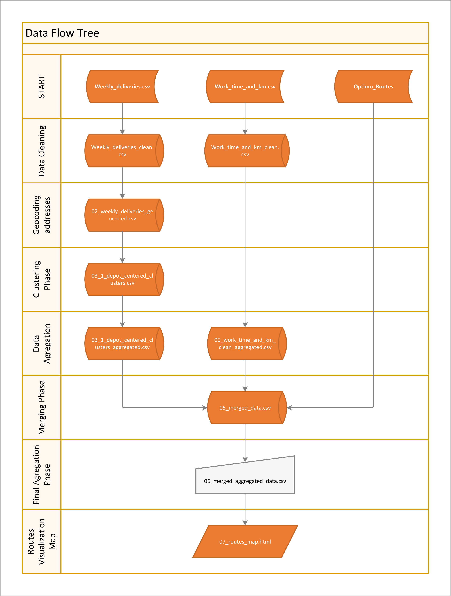

# Logistics Route Optimization in Estonia

**Executive Summary:** This project aims to optimize delivery routes for a last mile logistic operation in Estonia using clustering techniques and route analysis. By grouping customers geographically and refining delivery routes, the goal was to reduce total travel distance and time while maintaining service quality. Two datasets (885 customer deliveries and 20 route logs) were analyzed. Using K-means clustering to zone delivery points and route optimization methods, the project achieved an estimated **33% reduction** in total driving distance (from ~1300 km to ~850 km), surpassing the initial target of 15% reduction. Through better route planning, this translates to lower operational costs and reduced driver fatigue.

## Project Goals and Approach

- **Cluster Customers Geographically:** Identify clusters of delivery locations to create zones. We formed 3 eographic clusters from 885 delivery points, which help organize deliveries into shorter, logical routes within each region.
- **Optimize Delivery Routes:** Within each cluster, plan efficient routes to minimize distance and time. Routing constraints (vehicle capacity, working hours, etc.) were considered in planning feasible routes. Optimized routes reduced total distance by about 33%, using only 4 routes to cover all deliveries (versus the original setup).
- **Analyze Performance:** Compare the optimized routes against original routes on key metrics – total distance, time, and workload balance. We also explored correlations (e.g., between number of deliveries and route time) to understand operational efficiency.

## Data and Tools Used

- **Datasets:** 
  - *Customer Deliveries:* Detailed one-week delivery records (March 17–23, 2025) in Estonia, including addresses and volumes per stop.
  - *Route Performance:* Daily route logs for the same week (distance traveled and working time per route).
- **Programming & Analysis:** Python and Jupyter Notebooks for data cleaning, geocoding, and clustering analysis. Key libraries: pandas (data manipulation), scikit-learn (K-means clustering), and Folium/Leaflet for map visualization.
- **Geocoding API:** HERE Geocoding API to convert addresses to latitude/longitude coordinates for mapping and clustering.
- **Routing Tool:** *OptimoRoute* was used externally to generate an optimized routing plan given the clustered deliveries (taking into account real road distances and route constraints).
- **Visualization:** 
  - *Tableau* for an interactive dashboard summarizing delivery and route metrics.
  - *Leaflet* (via Folium in Python) to create an interactive map of the optimized routes.
- **Other:** Excel was used for initial data inspection, and Git/GitHub for version control and collaboration.

## Repository Structure

```text
├── notebooks/          <- Jupyter notebooks for each step of the analysis
├── data/               <- Data files (raw and processed)
├── results/            <- Outputs: maps, dashboard, etc.
├── scripts/            <- Reusable Python scripts (if any)
├── README.md           <- Project documentation (this file)
└── .gitignore          <- Git ignore rules
```

## How to Reproduce or Run This Project

1. **Clone the Repository:** Download or clone this repo to your local machine using `git clone`.
2. **Install Dependencies:** Make sure you have Python 3.x installed. Install the required packages using pip:
   ```bash
   pip install -r requirements.txt
   ```
3. **Obtain API Key:** This project uses the HERE API for geocoding addresses. You will need to sign up for a free HERE developer account and get an API key. Create a file named `.env` in the project root with the line `HERE_API_KEY=<your_api_key>` (this file is in .gitignore and not part of the repo).
4. **Run Notebooks:** Open the Jupyter notebooks in the `notebooks/` folder in order:
   - Start with `01_data_cleaning.ipynb` to clean and prepare the raw data.
   - Next, `02_geocoding.ipynb` to geocode addresses (uses the HERE API to get coordinates).
   - Then `03_clustering.ipynb` to perform K-means clustering on the delivery points.
   - Continue with `04_route_planning.ipynb` (if provided) to see how routes were optimized for each cluster (or refer to external routing results).
   - Finally, `05_data_merging.ipynb` to combine the data and analyze the impact (e.g., compare original vs optimized routes).
   Ensure you run them sequentially, as later notebooks depend on outputs (CSV files) from earlier ones.
5. **View Results:** After running the analysis, you can:
   - Open the `results/routes_map.html` file in a web browser to interactively view the optimized routes on the map. The map shows each route and stop, demonstrating how clustering reduced travel distance.
   - Open the Tableau dashboard (link below) to explore summary visualizations of the routes and deliveries.

## Project Workflow

The following diagram illustrates the data flow and processing steps in this project:



## Results and Deliverables

- **Tableau Dashboard:** [Logistics Dashboard (Estonia Routes)](https://public.tableau.com/views/Logistic_dashboard_by_DK/01_Deliveries_overview?:language=en-US&publish=yes&:sid=&:redirect=auth&:display_count=n&:origin=viz_share_link) – An interactive Tableau Public dashboard illustrating delivery volumes, distances, and route comparisons.
- **Interactive Route Map:** *Leaflet map* showing optimized routes and clusters. This is available as `results/route_map.html` in the repository. *(If viewing the GitHub repository, download and open this HTML file locally to explore the map.)*
- **Project Report: Review `results/01_Data research project.pdf` for a detailed project report.

The results indicated that reorganizing deliveries into four clusters and planning optimized routes led to a substantial efficiency gain – total driving distance was cut by roughly one-third. This suggests significant potential for cost savings and improved driver scheduling. The Tableau dashboard provides further insights, such as which clusters had the highest delivery counts and how route times correlated with distances.

## Conclusion

This project combines data analysis (clustering) with route optimization to demonstrate how logistics operations can be made more efficient. The approach and findings can inform route planning for future weeks and other regions. Importantly, this project showcases skills in data cleaning, geospatial analysis, algorithmic thinking (optimization), and visualization—all of which are valuable in data analytics and data science roles.
